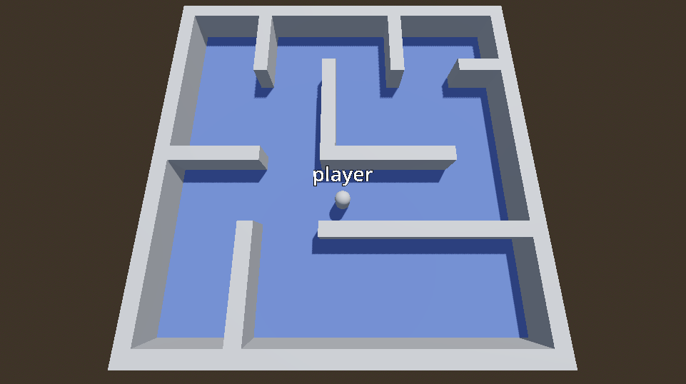
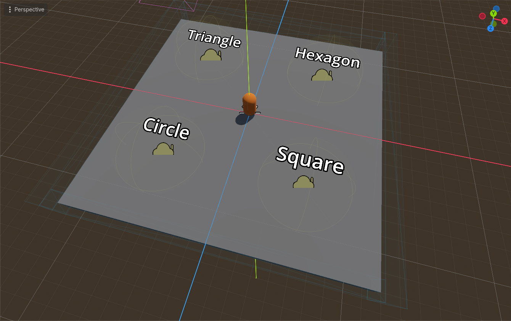
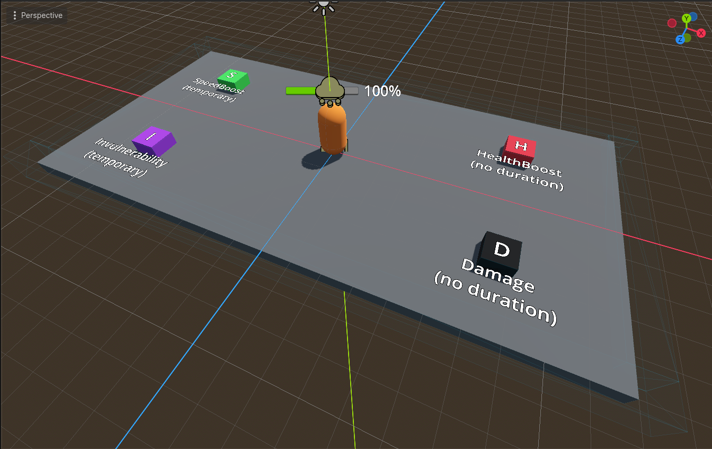
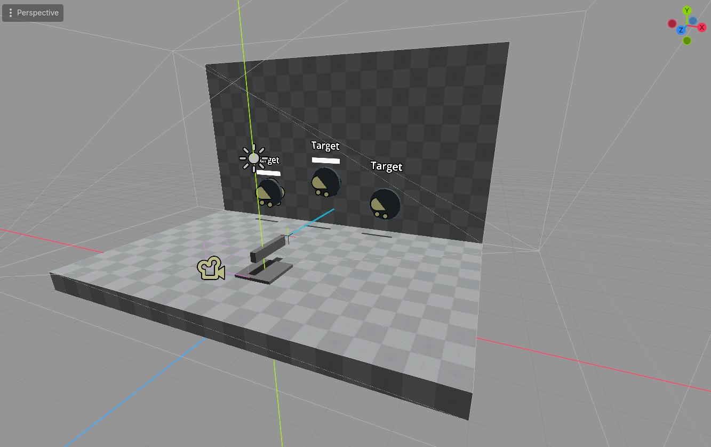
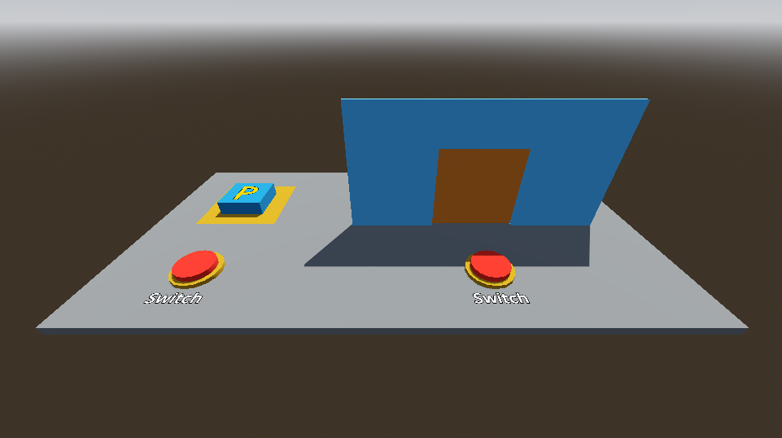

# SOLID design principles in Godot-4
Learning [Godot 4 Engine](https://godotengine.org/) using gdscript by recreating the examples from within unity's ebook [Level up your code with design patterns and SOLID](https://unity.com/resources/design-patterns-solid-ebook).

## 📁 Projects
- **Single Responsibility**
- **Open Closed**
- **Liskov Substitution**
- **Interface Segregation:**
- **Dependency Inversion**

## 📝 Notes
Using Godot version 4.6

GdScript does not have interfaces like Csharp but the [Godot's design philosophy](https://docs.godotengine.org/en/stable/getting_started/introduction/godot_design_philosophy.html) talks about using oop and composition.

## ⭐ Acknowledgements
Assest from [Kenney](https://kenney.nl/)

RyanJuckett.com [Damped springs](https://www.ryanjuckett.com/damped-springs/)

## Screenshots 
Single

Open closed

Lizkov

Interface Segregation

Dependency Inversion

